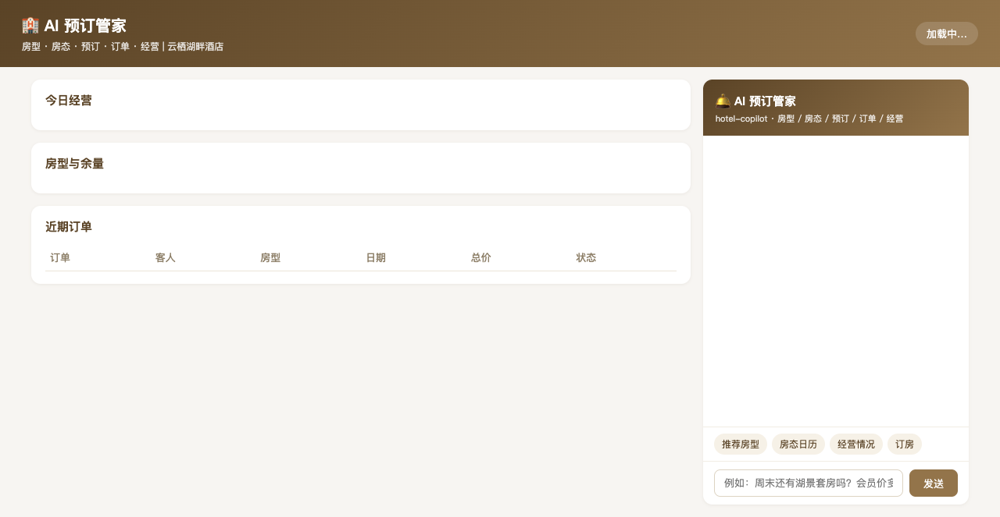
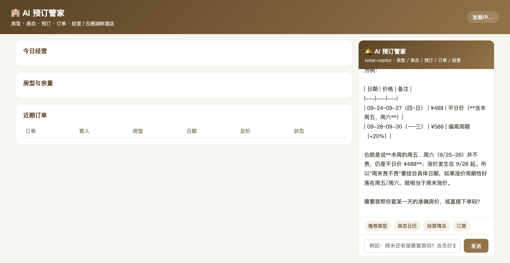
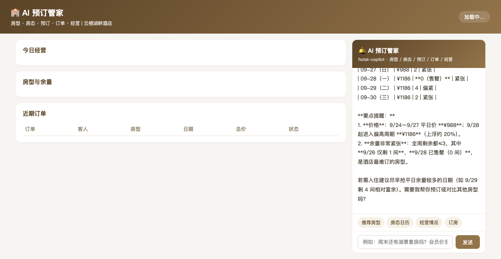
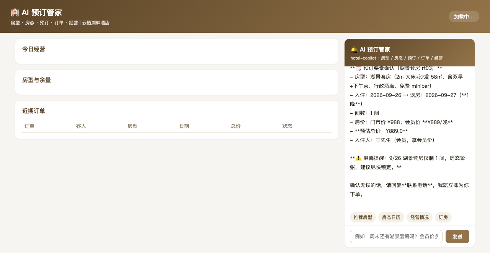

# AI 预订管家 · 使用说明

> 面向酒店前台/预订员/客人的操作手册。左侧是房型与经营数据，右侧 AI 助手用自然语言问房、比价、下单、查订单。

## 一、页面导览

打开 `http://127.0.0.1:18095/`：

1. **顶部横幅**：入住率与平均房价（ADR）一眼看清。
2. **今日经营卡**：入住率 / 平均房价 / 在店收入 / 经营建议。
3. **房型与余量**：5 类房型的床型/面积/权益，门市价与会员价并列，余量≤3 红标「紧张」。
4. **近期订单**：订单号/客人/房型/日期/总价/状态。
5. **AI 预订管家**（右侧面板）：快捷提问 + 输入框，SSE 流式回答。

## 二、AI 能干什么（对应 5 个工具）

| 你说的话 | AI 做的事 | 背后工具 |
|----------|-----------|----------|
| "有什么房型/两人住推荐" | 列房型、比价、报权益与余量 | `room_list` |
| "某天有没有房/周末贵吗" | 报 7 天房价与余量，标记紧张/售罄日 | `calendar` |
| "帮我订房" | 复述订单要素二次确认后下单，报订单号与总价 | `book` |
| "我的订单/预订到几号" | 按状态列订单明细 | `booking_list` |
| "入住率多少/经营怎么样" | 入住率/ADR/收入/分房型分析 | `stats` |

## 三、典型对话示例

**例 1 · 比价推荐**

> 你：两个人住，推荐个性价比高的房型，周末贵吗？
> AI：首选**高级大床房**（会员 ¥439/晚，含双早+延迟退房+欢迎水果，余 7 间）。**周五周六上浮约 20%**（¥488→¥586）。

**例 2 · 二次确认下单**

> 你：我是会员王先生，订一间高级大床房，9月25日入住9月27日退房
> AI：请确认：高级大床房 ×1，09-25→09-27 共 2 晚，会员价 ¥439/晚，**总价 ¥878**。请提供联系电话。
> 你：电话 138****5678
> AI：✅ 预订成功！订单 B101，总价 ¥878。

**例 3 · 库存紧张提醒**

> 你：订一间湖景套房，9月26日入住
> AI：湖景套房 ¥889/晚（会员价）。⚠️ **9/26 仅剩 1 间，房态紧张**，建议尽快锁定。确认无误请回复联系电话。

## 四、回答规则（系统提示词已内置）

1. 报价必须区分**门市价与会员价**，总价 = 每晚价 × 晚数 × 间数。
2. 余量紧张（≤3 间）或周末涨价**必须主动告知**。
3. 下单前必须**复述订单要素并获确认**，未确认不得下单；下单后必报订单号。
4. 改期/取消先确认身份（姓名+手机尾号）。
5. 数据全部来自工具返回，禁止编造房型与房价。

## 五、常见问题

**Q：会员价怎么生效？**
下单时报会员姓名（如「我是会员王先生」），系统自动匹配会员档案并按 `memberPrice` 计价。

**Q：能超订吗？**
不能。剩余间数不足时下单直接被拦截，AI 会说明余量并建议调整间数或日期。

**Q：周末涨价规则？**
房态日历中周五、周六在门市价基础上上浮 20%，AI 会主动说明并推荐平价日期。

**Q：AI 没反应？**
确认 DSH 服务（127.0.0.1:8090）在运行、`hotel-copilot` 插件处于 ACTIVE 状态，见 README「快速开始」。
